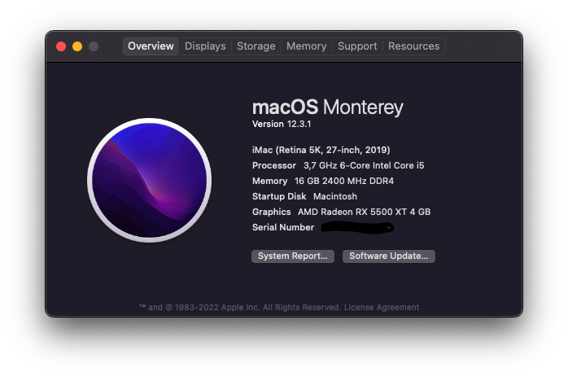

## My MSI Z390-A-PRO OpenCore Config for Hackintosh

I used macOS Monterey 12.3.1 with OpenCore 0.7.9 to install macOS. This config is created from Dortania's guide. It has only the most necessary drivers to be minimal and not bloated (Except OpenCanopy for OpenCore theme :) ). USB Mapping stays default as every port is working fine. By default, the front USB ports only support USB 3.0. If you want to map USB ports, you can checkout [Hackintool](#Hackintool)

**Note:** I leaved PlatformInfo blank. You have to create SMBIOS to boot OpenCore and of course work Mac App Store, Siri etc. [GenSMBIOS](#GenSMBIOS)

## Sources

### Opencore:

[https://github.com/acidanthera/OpenCorePkg](https://github.com/acidanthera/OpenCorePkg)

### Propertree:

[https://github.com/corpnewt/ProperTree](https://github.com/corpnewt/ProperTree)

### Hackintool:

[https://github.com/headkaze/Hackintool](https://github.com/headkaze/Hackintool)

### GenSMBIOS:

[https://github.com/corpnewt/GenSMBIOS](https://github.com/corpnewt/GenSMBIOS)

## Hardware

CPU: Intel Core i5 9600K

Motherboard: MSI Z390-A Pro BIOS 7B98v1D

RAM: Crucial Ballistix Sport LT 2x8 GB DDR4 3200 Mhz CL16

GPU: AMD Radeon RX 5500XT

##  What's not Working

You tell me :)
